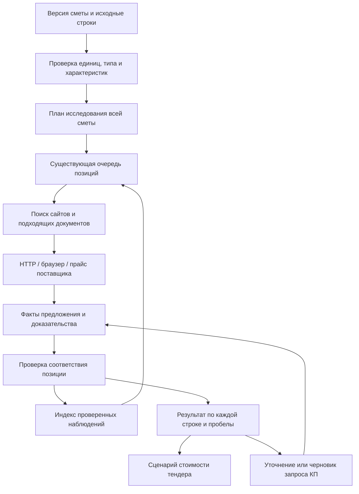

# Автобот: модуль поиска и проверки цен по всей смете

Дата: 19 сентября 2026 года. Основание — запрос пользователя на большой модуль реальных цен по всем позициям и последующее поручение реализовать его без платного поиска. **Реализованы требования позиции, очередь всей сметы, остановка и фильтры причин пробелов; расширяется бесплатный поиск и проверка источников. Универсальный охват ещё не доказан.** Исходные версии этого пакета: Автобот — `99afae4`, CRM — `01f6a79`. Авито и Hermes отложены. Фактические проверки и выпуск фиксируются в [журнале](AUTOBOT_IMPLEMENTATION_2026-09-14.md).

## Результат для пользователя

Пользователь добавляет смету, задаёт регион и условия тендера и запускает поиск по всей смете. Каждая исходная строка получает результат: пригодная цена с доказательством, предложения на проверку, конкретное уточнение, остановка источника либо необходимость КП. Прогресс сохраняется после закрытия вкладки и перезапуска сервера. Повторный запуск продолжает незавершённое и обновляет устаревшие цены.

Цель — обработать **все строки**, находить максимально возможное число **сопоставимых подтверждённых предложений** и честно показывать остаток. Публичной фиксированной цены может не быть у заказного изделия или сложной работы. Такой пробел закрывается уточнением или КП; случайное число не появляется в себестоимости.

Модуль должен отвечать на три разных вопроса:

1. Что именно нужно купить или выполнить и в каком количестве?
2. Какие актуальные предложения подходят к этой потребности и при каких условиях?
3. Как эти предложения влияют на стоимость исполнения и какие расходы ещё неизвестны?

## Что уже проверено

Исходные diff сохранены в `tmp/autobot-price-module-20260919/baseline.json` и `*-baseline.diff`. Чужие `.agents/`, `.codex/` и `auto_bot/data/search_resume_checkpoint.json` не изменялись. Анализ выполнен по коду `99afae4`, а не по первоначальному аудиту сентября.

### Локальные сметы

Read-only инвентаризация 48 файлов `ОТЧЕТ_ПО_СМЕТАМ_<номер>.xlsx`: 10 229 непустых строк. Сводные выгрузки и рыночные отчёты исключены. Контрольная сумма каждого файла до и после совпала; сеть в диагностическом Python-процессе заблокирована. Это локальные сохранённые файлы, **не выборка уникальных закупок и не измерение текущего покрытия production**.

| Проверка действующими правилами | Количество |
|---|---:|
| Строки, для которых `build_search_plan.can_auto_price` разрешает поиск | 7 287 |
| Строки, которым действующие правила не разрешают автоматический поиск | 2 942 |
| Пустая единица | 830 |
| Значение `1.0` в колонке единицы | 1 488 |
| Классифицированы как работы / услуги | 3 996 / 429 |
| Классифицированы как материалы / товары | 2 681 / 1 911 |
| Не определён тип / сводные строки | 1 153 / 59 |

Группы пересекаются: складывать пустые единицы, неопределённый тип и 2 942 заблокированные строки нельзя. Разрешённый поиск не доказывает правильность распознавания, наличие реальной цены или сопоставимость сумм. `1.0` нельзя автоматически превратить в «шт»: нужно вернуться к исходному документу и проверить колонку. Эти наблюдения задают приоритет исправлений, но не являются основанием переписывать рабочие сметы.

### Воспроизведённые ограничения поиска

| Вход | Наблюдаемое поведение `99afae4` | Последствие |
|---|---|---|
| Щебень из плотных пород, фракция 20–40 мм | Запрос становится «щебень гранитный» | Теряется фракция, исходное требование заменяется частным видом |
| Камень бортовой БР 100.30.15 | Остаётся «камень бортовой бетонный БР» | Теряется типоразмер |
| Кабель ВВГнг-LS (3х2,5 мм²) | Скобки вместе с содержимым удаляются | Теряется сечение и число жил |
| Штукатурка гипсовая КНАУФ Ротбанд (30 кг), шт | Классифицируется как работа; упаковка удаляется | Поиск услуг вместо товара |
| Георешетка полиэтиленовая высотой 150 мм, м², без шифра | Тип `other`, запросов нет | Пригодный для каталогов материал вообще не ищется |
| Каталог дал ссылки, но они не подтвердились | HTTP-поиск вызывается только при пустой выдаче каталога | Повторные запросы могут возвращать те же бесполезные ссылки |
| Запуск через `/api/tenders/<id>/agent-market/jobs` | По умолчанию 20, максимум 50 заданий за пакет | Пользовательский запуск ещё не означает обработку всей сметы |

Примеры названий в этой таблице — диагностические входы, а не обнаруженные закупочные предложения. Подробные данные и воспроизводящий скрипт: `tmp/autobot-price-module-20260919/input-audit.json`, `audit_inputs.py`, `run_audit.py`.

В предыдущем выпуске живым запуском проверен М300 в Ярославле: 6 700 ₽/м³, доставка отдельно, один источник. Начальный реестр содержит только три каталога Ярославля. Поиск Google/Yandex через серверный браузер упирался в CAPTCHA; остальные испытания описаны в [журнале](AUTOBOT_IMPLEMENTATION_2026-09-14.md). Это основание подключить нормальный канал обнаружения сайтов, а не обещать широкое покрытие от одного Chromium.

## Архитектура

Сохраняем Python, SQLite, текущие API и очередь. Новые модули выделяются по функции; отдельные микросервисы, векторная БД и новый frontend-фреймворк этому этапу не нужны.

| Граница | Что делает | Что используем / меняем |
|---|---|---|
| Описание потребности | Исходная строка, тип, обязательные признаки, единица, количество, регион | Выделение из `market_strategy`; проверка результата парсера, сохранение исходного текста |
| План всей сметы | Учитывает каждую строку, объединяет только совместимые исследования, определяет приоритет и бюджет | Новый планировщик поверх `agent_market_queue`; позиционные ключи и версии сохраняются |
| Обнаружение источников | Находит реальные URL товара, услуги, прайса; не подтверждает цены | Бесплатные доступные веб-каналы + каталоги поставщиков, необязательный Gemini |
| Получение документов | Открывает источники, сохраняет дату, URL, контрольную сумму и фрагмент | Существующий `WebBrowserFetcher`, HTTP-кеш; далее прайсы XLSX/PDF |
| Извлечение предложений | Из выбранной карточки/строки таблицы получает сумму, единицу и условия | `market_source_adapters`; отдельные правила для карточек, таблиц и документов |
| Проверка соответствия | Решает, можно ли сравнивать предложение с данной строкой | `market_evidence_policy` / `market_contract`; одна политика на запись и чтение |
| История цен | Повторно использует подходящие свежие наблюдения; хранит прежние | `market_price_index`; старую дату получения не заменяем датой чтения кеша |
| Полнота и экономика | Показывает пробелы, стоимость и готовность сценария | `tender_detail` и текущая экономика; доставка/резерв/налоги задаются для тендера |

### Описание позиции

Сохранять `position_id`, версию документа, лист/страницу и строку, исходный текст и единицу. Отдельно формировать нормализованное описание с происхождением каждого признака: извлечён из документа, подтверждён пользователем, предположен системой. Предположение не становится обязательной характеристикой или доказанным фактом автоматически.

Обязательные для сопоставления признаки: материал и тип изделия, марка/модель, размеры/сечение/фракция, класс/прочность, состав, комплектность, единица цены. Для работ — операция, способ выполнения и состав; для техники — назначение, производительность или требуемые параметры, время и условия аренды. Числа в скобках и в конце длинного названия сохраняются. Неизвестные значения остаются неизвестными.

Разрешённые эквиваленты оформляются отдельно от точного совпадения. Например, «плотные горные породы» не нормализуется безусловно в «гранит»: альтернативный материал проходит отдельную проверку требований. Автоматическое исправление недостающих характеристик по самой дешёвой найденной карточке запрещено.

### Разные способы поиска

| Тип потребности | Поиск и подтверждение |
|---|---|
| Серийный товар, кабель, светильник, крепёж | Артикул/марка + параметры; карточка производителя или продавца; упаковка и доступность |
| Бетон, песок, щебень, грунт | Региональный поставщик, точная марка/фракция/вид; объём, минимальная партия и доставка |
| Сухие смеси, краски, рулонные материалы | Точный продукт и фасовка; масса/площадь упаковки из предложения, показанный пересчёт |
| Монтаж, демонтаж, отделка, земляные работы | Прайс подрядчика и состав работы, объём, механизированный/ручной способ; отдельно материалы |
| Аренда и перевозка | Машина/услуга, час/смена/рейс, минимальный заказ, оператор/топливо/подача; условия из источника |
| Заказное изделие или комплексная работа | Разбор на подтверждённые ресурсы либо КП на исходный состав; не складывать ресурсы повторно с комплексной ценой |
| Итог, НДС, коэффициент, нормативная поправка | Остаётся учтённой строкой сметы; отдельная товарная цена не ищется |

### Каналы обнаружения

**Платный поиск исключён по последнему указанию пользователя.** Yandex Search API не подключаем. Основные каналы — публичные каталоги поставщиков через обычный браузер и существующий бесплатный HTTP-поиск. CAPTCHA останавливает работу с источником; обход защиты, подмена профилей и ротация прокси не применяются. Регион в запросе помогает ранжированию, но не доказывает доставку.

Каналы работают последовательно по оставшимся пробелам: свежий совместимый индекс → подключённые каталоги → бесплатный HTTP-поиск по следующим запросам. Наличие непригодных ссылок из каталога не останавливает переход дальше. Каждый ряд получает отдельный бюджет страниц; отрицательный кеш сохраняет паузу для заблокированных сайтов. Дорогие позиции идут раньше дешёвых внутри типа. Несколько страниц одного продавца не считаются разными поставщиками.

Gemini может извлекать признаки и предлагать запросы, но не подтверждать цену собственным ответом. По официальной документации на 19 сентября у Gemini 2.5 Flash есть бесплатная квота Google Search grounding; у новых моделей условия отличаются. Реальный доступ зависит от аккаунта и поддерживаемого региона. Ключ не получен, соединение не настроено и запросы не выполнялись. Бесплатный тариф допускает использование переданных данных Google для улучшения продуктов, поэтому передача целых рабочих смет по умолчанию не планируется; потенциальный канал получает только необходимые публичные названия и характеристики. Источники: [тариф](https://ai.google.dev/gemini-api/docs/pricing#gemini-2.5-flash), [регионы](https://ai.google.dev/gemini-api/docs/available-regions), [поиск](https://ai.google.dev/gemini-api/docs/google-search).

Реестр каталогов расширяется по категориям и регионам из контрольной выборки. Для каждого источника: URL, специализация, заявленный охват, способ доступа, поддержка прайса, последняя успешная проверка, состояние адаптера. Заявленная специализация помогает маршрутизации, но не подтверждает конкретный товар и его цену.

Агрегаторы допустимы для обнаружения поставщика. Их предложения допускаются в расчёт только при установленном продавце, конкретном товаре и проверенных условиях. Прайсы пользователя и КП имеют документ, поставщика, дату, срок действия и область доступа. Исторические закупки CRM показываются отдельно от актуальных предложений и сохраняют права доступа.

### Что такое реальная пригодная цена

Для каждого наблюдения хранить источник/поставщика, URL либо загруженный документ, дату получения и заявленную дату/срок цены, выбранный товар/строку таблицы, исходную сумму в копейках, валюту, исходную единицу, фасовку, характеристики, условия наличия/заказа, минимальную партию, регион/доставку, статус НДС и состав цены. Приложить сохранённый фрагмент и контрольную сумму документа. Поля, отсутствующие в источнике, не заполнять догадкой.

Отдельно хранить результат сопоставления с каждой позицией: совпавшие требования, противоречия, недостающие доказательства, допустимый пересчёт и причину решения. Одно предложение может подходить одной строке и не подходить другой. Проверка учитывает именно выбранный вариант товара; соседние цены в карусели или таблице не подменяют его.

Три уровня достоверности: **опубликованная цена**, **сопоставимая подтверждённая цена**, **подтверждённая стоимость закупки нужного объёма на условиях тендера**. Публичная цена сама по себе не подтверждает складской остаток, действительность оферты на нужный объём или стоимость доставки.

Цена «от», диапазон, рассрочка, цена доставки и общая статья сохраняются как ориентиры/кандидаты с причиной. Пересчёт упаковки допускается при доказанной фасовке; тонны в кубометры — только при подтверждённой плотности конкретного материала. Час в смену не переводится без указанной продолжительности. Цены в разных валютах и с разным налоговым статусом не усредняются молча.

Точный вариант и согласованный аналог показываются раздельно. Если есть одна подходящая цена, она видна как «1 поставщик»; система не приписывает ей согласие рынка. Для нескольких независимых источников показываются минимум, медиана и диапазон сопоставимых условий. Пользователь видит, какое предложение использовано в сценарии закупки; минимальная цена не выбирается автоматически при недоказанной комплектации.

### Обработка всей сметы

План запуска привязан к версии сметы и региону. Все строки попадают в план до начала сетевой работы. Приоритет по сумме и риску влияет на порядок, а не исключает дешёвые позиции. Малые партии заданий последовательно выдаются из полного плана; лимит 50 превращается в размер партии, а не обрезание сметы.

Общее исследование допустимо для одинаковых требований, единиц и условий региона/объёма. Результат повторно проверяется для каждой исходной строки. Нельзя объединять одно название с разными сечениями, фасовкой, способом работы или условиями оптовой цены. В очереди сохраняются отмена, lease/heartbeat, защита от повторной публикации и проверка версии сметы.

Состояния причины результата: `verified`, `candidate`, `needs_details`, `quote_required`, `no_verified_offer`, `source_unavailable`, `budget_exhausted`, `not_applicable`. Состояния выполнения остаются отдельными: запланировано, выполняется, ждёт внешний ответ, завершено, отменено. `quote_required` назначается по природе позиции или явному «по запросу» поставщика; пустая поисковая выдача сама по себе этого не доказывает.

Сохранять причины по каждому каналу. Ошибка всех провайдеров не выдаётся за «предложений на рынке нет». Источник с CAPTCHA получает паузу и понятную диагностику. Не повторять его для каждой строки. Ни CAPTCHA, ни ограничения доступа не обходятся.

## Стоимость и условия подключения

Пользователь отказался от платного поиска. Предложение Yandex/Brave из первой версии отменено; вопрос о бюджете закрыт. Аккаунты, подписки и платные запросы не создавались. В этой реализации используется существующий сервер, бесплатные веб-источники и локальный индекс.

Бесплатность не отменяет лимиты времени, количества страниц и доступности сайтов. Значение `MARKET_POSITION_TIMEOUT_SEC` ограничивает работу между сетевыми операциями; уже начатый запрос может закончиться позже. Частичный подтверждённый результат сохраняется. Возможное подключение Gemini требует доступного API и явного ограничения бесплатным режимом; пока оно не настроено.

## Роль ИИ

ИИ может предлагать категорию, структурированные характеристики, варианты запроса, соответствие строки прайса и список недостающих условий. На вход получает исходную позицию и ограниченные фрагменты источников; на выход — структурированные поля с указанием основания. Никакое число из ответа модели само по себе не принимается как цена.

Оркестратор задаёт конечную задачу, доступные инструменты, предел страниц/времени/расходов и формат ответа. Проверка единиц, версий, бюджета и публикация выполняются кодом. Бесконечный диалог моделей и самостоятельное одобрение моделью собственного результата не заменяют эти проверки. Содержимое страниц рассматривается как данные, а не инструкции исполнителю.

Для разработки сохраняется [ASTRA_CRM_WORKFLOW.md](ASTRA_CRM_WORKFLOW.md): одна законченная граница за пакет, проверка поведения, отдельная самопроверка diff. Подключение API конкретной модели и его расходы — отдельная настройка; наличие Astra в приложении Codex не используется как предположение о доступе из production.

## Представление результата и экономика

В существующей карточке тендера нужны три самостоятельных показателя: готовность позиций к поиску, покрытие подтверждёнными ценами и готовность экономики. Для покрытия показывать и количество строк, и долю суммы сопоставимой сметы. Строки с неизвестной суммой остаются отдельным счётчиком; итоги разделов не удваивают знаменатель. Для комплектной работы ресурсный разбор учитывается один раз.

У каждой позиции доступно: исходное требование, найденные варианты, единица и пересчёт, поставщик/ссылка/дата, условия, причина непринятия и следующее действие. Для всей сметы — обработано/осталось, текущая стадия, использованный лимит, пауза/отмена/продолжение. Запрос КП сначала формируется как черновик с перечнем позиций; автоматическая отправка поставщикам не входит в полномочия модуля.

Цена сметы, опубликованная цена рынка, выбранная стоимость закупки и прогноз полной себестоимости — разные значения. Работы, материалы и ресурсы одной комплексной расценки не суммируются дважды. Доставка, накладные, резерв и налоги вводятся **для каждого тендера, без произвольных процентов по умолчанию**. Неизвестный расход не принимается за ноль. Поиск цен не меняет утверждённую базу, фактические расходы или денежные движения CRM. Правила — [PROJECT_ECONOMICS_SPEC.md](PROJECT_ECONOMICS_SPEC.md).

## Пакеты реализации и приёмка

| Пакет | Законченный результат | Что доказывает готовность |
|---|---|---|
| **A. Требования позиции** | Тип, единицы и характеристики не теряются; каждая строка получает план или конкретное уточнение | Исправлены воспроизведённые примеры; товар/работа различаются; `1.0` не превращается в штуку; старые исходники сохранены |
| **B. Поиск по всей смете** | Один запуск охватывает полный план, продолжает партии после 50 строк, сохраняет причины и прогресс | 120 разных строк обрабатываются без выпадений; повторы, отмена, закрытая вкладка, перезапуск и изменение сметы проверены на изолированной БД |
| **C. Широкое обнаружение** | Бесплатный поиск и каталоги дополняют друг друга; после неудачных кандидатов поиск идёт дальше | Живой поиск вне трёх каталогов; проверка страниц в новых категориях, ограничения доступа и лимита сохранены |
| **D. Предложения разных категорий** | Карточки и прайсы материалов, работ и техники дают сравнимые доказательства | Не принимаются чужая модель, цена «от», фасовка другого размера, смена вместо часа, отсутствие регионального подтверждения; работа не подменяется товаром |
| **E. Пробелы и полная стоимость** | Видно, что найдено, что нужно уточнить или запросить; сценарий тендера использует только пригодные суммы | Неполное покрытие и неизвестные затраты препятствуют уверенному выводу о прибыли; повторное открытие сохраняет условия; 390/768/1280 px и роли проверены |
| **F. Приёмка охвата** | Измерены точность, покрытие, задержка и стоимость на представительной выборке | Контрольные позиции из разных категорий/регионов проверены по страницам; недоступность и отсутствие опубликованной цены учтены отдельно |

Все пакеты выполняются без платного поиска. C–D расширяют охват на проверяемых позициях, E использует готовые контракты, F проверяет весь пользовательский сценарий. Завершение очереди всей сметы не означает, что для каждой строки найдена публичная цена.

План данных: сначала только read-only диагностика; далее новые версионные результаты рядом с исходными. Исправление распознанных строк — через существующий механизм новой версии с сохранением оригинала и пересмотром зависимых цен. До добавления таблиц планов/операций нужен отдельный применимый план: backup, восстановление на копии, совместимость старой очереди, повторный запуск и откат. Массовая правка действующих Excel/SQLite по этому документу не разрешается.

### Контрольная выборка

Собрать размеченный набор из 120 строк реальных исходных смет: серийные товары, сыпучие материалы, фасованные/рулонные материалы, работы, техника/перевозка, комплексные/неоднозначные строки. Пропорции определить после просмотра оригиналов; добавить несколько регионов из реальных задач пользователя. Не подбирать набор только из категорий, где уже есть адаптер. Отдельно включить ошибки распознавания и заведомо неподходящие предложения.

Для каждой контрольной строки экспертная отметка описывает требования и допустимые условия; для каждого принятого предложения — сохранённая страница/документ и ручная сверка. Повторить по тому же набору после исправлений. Проверять:

- **Учёт строк:** 100% исходных строк находятся в плане; исключение итогов объяснено, неоднозначные позиции не потеряны.
- **Ошибочные подтверждения:** ни одно размеченное противоречие не принимается в расчёт; дополнительно проверить вручную все принятые цены пилота. Это критерий набора, а не обещание нулевых ошибок во всём интернете.
- **Покрытие:** доля строк и сметной суммы с подходящими ценами; отдельно по категориям, регионам и числу независимых продавцов. Целевые проценты коммерческого охвата определить по пилоту, не объявлять заранее 90–100%.
- **Причины пробелов:** документ/нормализация, нет подходящего предложения, нет опубликованной цены, сайт закрыт, лимит, требуется КП. Считать этап, на котором теряется покрытие.
- **Расходы и время:** запросы и стоимость на новую подтверждённую позицию, повторное использование индекса, время до первой цены и завершения сметы, доля повторов/ошибок.
- **Надёжность:** отмена, повтор, изменение версии/региона, восстановление после перезапуска, устаревание цены, конкурирующие задания и отсутствие утечки закрытых финансовых данных.

## Проверки этого документа и следующий шаг

Код маршрутов, очереди, планов, браузера, индекса и контракта сопоставления просмотрен. Диагностика выполнилась на изолированной копии кода с чтением локальных смет; итог — 48/48 файлов, 10 229 строк, ошибок чтения нет. Первый черновой запуск диагностики использовал неверное имя колонки; скрипт исправлен по действующему `COL_NAME`, общие выгрузки исключены, результаты выше получены повторным успешным запуском.

Первый пакет был только проектным. В реализации сохранены исходники и версии смет; миграции рабочих данных не нужны. Прогресс полного плана хранится в существующем payload очереди. Проверены 120 заданий до конца, отсутствие обрезания счётчиков на 1 205 заданиях, повторы и отмена с сохранением принятого результата. Интерфейс проверен в Chrome на 390/768/1280 px. Полный Python-набор: 884 passed, 2 skipped, 20 subtests passed; шесть существующих Node-наборов прошли. Самопроверка не является независимым ревью.

Остающаяся приёмка: расширить категории и регионы на представительной выборке, добавить разбор прайсов и подготовку запросов КП. Текущий паспорт извлекает узнаваемые явно записанные признаки; произвольные марки, состав комплексных работ, условия объёма и все варианты размеров ещё не покрыты универсально. Gemini остаётся необязательным каналом; ожидание ключа не блокирует основной модуль.
