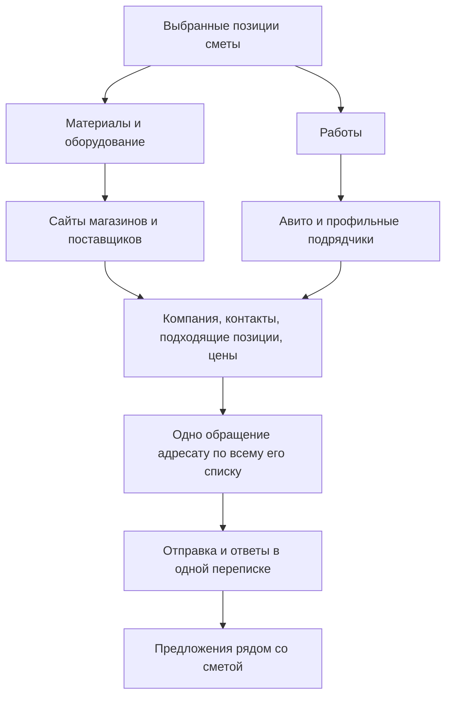

# Автобот: поиск поставщиков и исполнителей по смете

Дата: 26 сентября 2026. Статус: план для обсуждения, реализация этого плана не начата.

После уточнения пользователя подготовлен [технический проект реализации](AUTOBOT_SOURCING_TECH_SPEC.md):
конкретные модули, алгоритмы, таблицы, границы транзакций и проверки отказов.
Он уточняет технический способ почты: SMTP/IMAP как целевой транспорт с сохранением
проверенного браузерного скрипта до настройки и приёмки нового подключения.

## 1. Результат для пользователя

Пользователь выбирает смету или часть её позиций и запускает подбор. Автобот
находит подходящие компании и исполнителей, собирает опубликованные цены и
контакты, готовит одному адресату один запрос по всем подходящим ему позициям.
После запуска отправки сохраняет переписку, получает предложения и показывает
их рядом со сметой. По каждой позиции понятно, откуда взялась цена и чего ещё
не хватает для сравнения.

Основной принцип: искать по потребностям сметы, обращаться по поставщикам,
сравнивать по строкам или явно определённому комплексу работ.

## 2. На что опираемся

Прочитан контекст задачи «Составить план рефакторинга Автобота»
`01a09ee9-8819-7f60-afb3-a33eba78907a`, действующие планы и относящийся к сценарию код.

Исходное состояние локальных репозиториев:

- CRM: `c349e0d`, tracked diff пуст. Уже существовали неотслеживаемые `.agents/`,
  `.codex/` и каталоги `outputs/buyer-campaign-20260926/`,
  `outputs/buyer-script-pilot-20260926/`, `outputs/buyer-send-20260925/`,
  `outputs/buyer-walkthrough-20260925/`.
- AutoBot, `C:/Users/UserVik/Desktop/code/auto_bot`: `c6a0fa8`.
  Уже изменён `data/search_resume_checkpoint.json`, есть неотслеживаемая
  `.impeccable/`. Эти изменения сохраняются.

Текущий этап CRM — закупщик Автобота. Более свежий
[отчёт почтового пилота](AUTOBOT_SCRIPT_PILOT_2026-09-26.md) дополняет
[план закупщика](HERMES_BUYER_PLAN.md): отправка через Mail.ru переведена на
скрипт; один запрос проверен в «Отправленных». Получение нового реального ответа
с ценами в отчёте ещё не подтверждено. Это сведения предыдущего выпуска;
production и Mac в рамках составления этого плана заново не проверялись.

| Участок | Уже есть | Что требуется по этому запросу |
|---|---|---|
| Позиции и рыночные источники | Сметные строки, характеристики, поиск страниц, каталоги, проверка опубликованных цен | Соединить поиск с подбором новых адресатов для обращений |
| Подбор адресатов | Фиксированный региональный реестр; `buyer_suppliers.prepare` ограничен Ярославской областью | Искать новые компании в регионе выбранного объекта; реестр использовать как начальную базу |
| Обращения | Скриптовый шаблон, объединение строк, скрытие сметной цены | Подключить найденных поставщиков и исполнителей, проверить охват и дубли между каналами |
| Отправка | Очередь, журнал попыток, скрипт Mail.ru, подтверждённый почтовый пилот | Проверить восстановление и чтение ответов; отдельно реализовать рабочий сценарий Авито |
| Ответы | Привязка к запросу, проверка цены и единицы по исходному тексту | Доказать живой цикл; поддержать частичные ответы, общую цену за комплекс и вложения |
| AI | Один выделенный `autobot-mail` | Сохранить одного закупщика; регулярные операции выполнять скриптами |

Существующие URL/API, права доступа, исходные сметы, подтверждённые предложения,
старые очереди и истории отправок сохраняются. Пересоздание агентов, рабочего
реестра и журналов для выполнения плана не требуется.

## 3. Подготовка потребностей

Для строки сохраняем исходный ID, версию сметы, наименование, характеристики,
количество, единицу и раздел. Регион, место поставки/работ и известные сроки
берём из объекта. Отдельно формируем понятное поисковое название.

Разделяем материалы/оборудование и работы. Заголовки, итоги, коэффициенты,
отрицательные корректировки и прочие расчётные строки не становятся закупками.
Неизвестные модель, размер или объём остаются конкретными вопросами по строке.

Одинаковые потребности можно искать один раз и объединять в запросе при одинаковых
характеристиках, условиях и сроках. Связи со всеми исходными строками остаются.
Единицы приводятся только по проверяемому коэффициенту: например,
`10,4 × 100 м = 1040 м`. Тонны и кубометры без подтверждённой плотности не смешиваем.

Сметная цена и бюджет остаются внутри CRM: их нет в поисковых запросах,
обращениях, приложенных перечнях и контексте закупщика для общения с поставщиком.

## 4. Поиск: первые 10 источников и проверка пригодности

### Материалы

1. Для конкретного товара ищем название, важные характеристики и регион:
   например, `кабель ВВГнг-LS 3х2,5 купить Рыбинск`.
2. Для группы дополнительно ищем профильных поставщиков: `электроматериалы
   оптом Ярославская область`. Это помогает запросить сразу всю электрику.
3. Первый проход — до 10 разных сайтов-кандидатов для уникальной потребности
   или группы. Повторяющиеся результаты и страницы одной компании объединяем.
4. Открываем страницы товаров, каталога, контактов и условий поставки.
   Сохраняем опубликованную цену, если удалось подтвердить именно нужный товар,
   единицу и условия. Цифра из поискового фрагмента служит поводом открыть страницу.
5. Для найденной компании проверяем остальные подходящие позиции выбранной сметы,
   в том числе из других разделов. Формируем её общий список для запроса.

Предложение для первого пилота: до трёх вариантов поискового запроса и до 30
уникальных сайтов на потребность/группу с общим лимитом задания. Если первая
десятка дала мало подходящих компаний, используем следующий проход. Настройки
лимитов явные; по исчерпании остаётся объяснение результата, поиск не бесконечен.

### Работы

Ищем специалиста или подрядчика по комплексу работ и местоположению:
`электромонтаж Рыбинск`, `монтаж наружного освещения Ярославская область`.
Основной заданный пользователем источник — Авито; сайты профильных компаний
дополняют его. Простой поиск слова «электрик» не подтверждает возможность
выполнить наружные сети, установку опор или измерения: профиль проверяется по
реальному перечню работ и объявлению.

Для Авито первая выборка — до 10 разных подходящих исполнителей; несколько
объявлений одного профиля объединяем. Цена «от 500 ₽» сохраняется с пометкой
«от» и своим составом услуги; стоимость всего нашего перечня выясняется отдельно.

Для каждого кандидата фиксируем запрос, источник, дату, регион, ассортимент или
специализацию и причину соответствия. Подходящий профиль позволяет обратиться;
точное наличие всех материалов и согласие исполнителя выясняются в ответе.

### Технический способ

Переиспользуем существующие `market_strategy`, `browser_search_results`,
`market_source_adapters`, каталоги и ограничения поиска. Добавляем передачу
найденных компаний в контур закупщика, а не отдельный поисковый продукт.

Для программной выдачи возможен Search API. Например, официальный
[Yandex Search API](https://aistudio.yandex.ru/ru/docs/search-api/api-ref/WebSearchAsync/search)
поддерживает текст запроса, регион, страницы и группировку по домену. Выбор
провайдера и бюджет проверяются перед подключением; новый платный сервис пока
не подключается. Имеющийся браузерный поиск остаётся способом проверки кандидата.

Недоступный сайт, авторизация и ограничение площадки становятся явными
состояниями задания. Повторы ограничены и продолжают сохранённый поиск.

## 5. Компания, ассортимент и контакт

У компании храним сайт/профиль, опубликованное название, регион, проверенные
каналы, страницы-источники контактов и связанные потребности.

Идентичность компании проверяем по домену, профилю продавца и подтверждающим
контактам. Все объявления Авито нельзя объединять по домену `avito.ru`.
Совпадение одного общего телефона также не всегда означает одну компанию.

Связь «компания — потребность» имеет основание: точная карточка товара,
подходящий ассортимент, профиль работ, ответ поставщика либо отказ.
В интерфейсе различаются «можно запросить» и «подтверждено предложение».

Сохраняем email, телефон и опубликованные ссылки Telegram/WhatsApp/MAX.
Обычный телефон не превращается автоматически в подтверждённый мессенджер.
На старте выбираем один доступный канал обращения к компании. Смена канала
сохраняет общую историю и не создаёт повторный запрос автоматически.

## 6. Одно обращение по всему подходящему перечню

Магазину электрики — кабель, автоматы, щит, светильники и остальные подходящие
материалы. Электромонтажнику — весь подходящий комплекс работ с объёмами.
Компании с несколькими направлениями — все подходящие строки выбранной сметы.
Если она может закрыть только часть, запрашиваем эту часть и сохраняем остаток.

Обращение формирует скрипт. В нём есть место поставки/работ, известные сроки,
список с номерами, характеристики и объёмы, просьба указать собственные цены
и условия. Для длинного перечня готовится короткое сообщение и отдельный файл
без сметных цен; сохраняется соответствие его номеров исходным строкам.

Пример для работ, значения ниже условные:

> Добрый день! Нужно выполнить электромонтаж на объекте в Рыбинске:
> прокладка кабеля — 200 м, установка розеток — 30 шт., сборка щита — 1 шт.
> Подскажите, сможете взять весь перечень? Укажите стоимость по пунктам и общую
> сумму, сроки начала и выполнения, с НДС или без. Материалы, технику и выезд
> укажите отдельно. Если для расчёта нужен осмотр, напишите, какие данные нужны.

Для материалов дополнительно спрашиваем наличие полного объёма, цену за
единицу и весь заказ, доставку и срок действия предложения. Замены предлагаются
отдельно с характеристиками. Сметная стоимость не подсказывает поставщику ответ.

Цена за весь комплекс работ допустима. Её сравниваем с соответствующим комплексом
сметы; не распределяем произвольно по строкам. По возможности запрашиваем разбивку.

## 7. Отправка и каналы

Целевой запуск: выбор позиций → подбор → список адресатов и готовые обращения →
один запуск выбранной партии. Не нужен ручной запуск каждой строки. Дальше
система отправляет последовательно, получает ответы и показывает только
конкретные вопросы, требующие решения. В рамках текущего запроса составляется план;
новые обращения поставщикам не отправляются.

| Канал | Порядок внедрения и доказательство готовности |
|---|---|
| Email | Развить проверенный скрипт Mail.ru; отправка, получение ответа, восстановление после сбоя и поиск по нескольким страницам |
| Авито | Проверить доступ рабочего аккаунта к поиску, началу диалога по чужому объявлению и чтению ответа; затем реализовать весь цикл для одного комплекса работ |
| Telegram | Подключить подходящий способ работы с доступным аккаунтом и перепиской; обычный Bot API не считать готовым средством первого обращения |
| WhatsApp | Проверить опубликованный канал и применимый способ отправки; для Business Platform учитывать согласие получателя и шаблоны |
| MAX | Проверить реального получателя и доступный диалог; наличие Bot API само по себе не доказывает возможность первого обращения по найденному телефону |

Ограничения, проверенные по первичным источникам 26 сентября:

- Обычный Telegram-бот не может первым начать диалог с пользователем —
  [документация Telegram](https://core.telegram.org/bots#how-are-bots-different-from-users).
- WhatsApp Business требует согласия получателя; Business Platform отдельно
  ограничивает начало переписки шаблонами —
  [политика WhatsApp](https://whatsappbusiness.com/policy/).
- У MAX отправка адресуется по `user_id`/`chat_id` с токеном бота —
  [метод отправки MAX](https://dev.max.ru/docs-api/methods/POST/messages).
  Возможность нужного исходящего сценария ещё требуется проверить на аккаунте.
- Официальная страница API Авито в ходе исследования не открылась. Наличие
  API не принимается за доказательство поиска любых объявлений и первого
  сообщения любому продавцу. Проверка доступного аккаунта/API или обычного
  интерфейса — ранняя зависимость этапа Авито.

Эти каналы подключаются по одному. Недоступный канал остаётся видимым вместе
с причиной; готовый текст и ссылка позволяют продолжить конкретный диалог
вручную. Ручной проход не отмечается как успешная автоматизация.

Очередь использует существующие состояния и журнал. «Отправлено» подтверждается
сообщением в переписке/«Отправленных», адресатом и текстом. Нажатие кнопки не
является достаточным доказательством. При потере подтверждения сначала сверяем
историю; `uncertain` нельзя автоматически отправлять повторно.

Защита от дублей действует на компанию, объект, версию запроса и пересекающиеся
позиции, включая разные каналы. Уточнение — отдельное сообщение в той же
переписке, а не новая начальная рассылка. Отказ от общения прекращает обращения.
Скрипт отправки и единственный AI-закупщик не управляют общим браузером одновременно.

## 8. Ответы и сопоставление цен

Чтение ответов сохраняет идентификатор сообщения, исходный текст/вложение,
отправителя, время и связь с запросом. Один ответ нельзя принять повторно после
перезапуска. Проверка не ограничивается последним видимым сообщением или первой
страницей почты. Начать можно с текстовых ответов; PDF/XLSX добавляются следующим
законченным пакетом с сохранением исходного файла.

Из ответа извлекаем: соответствующую позицию либо комплекс, предложенный товар,
объём, единицу, цену, НДС, доставку, наличие, сроки и срок действия предложения.
Подтверждение каждой цены связано с исходным фрагментом ответа или ячейкой файла.
AI может помочь понять свободный текст, но расчёты и проверку соответствия
проводит код. Новые AI-профили для этого не создаём.

Частичный ответ заполняет только названные позиции. Отказ, неизвестная цена,
другой товар, сумма за комплект и необходимость осмотра — разные состояния.
Если заказ или характеристики изменились после отправки, старое предложение
остаётся у своей версии, а актуальность проверяется явно.

У строки доступны несколько предложений с источниками и условиями. Различаем
«цена на сайте», «ответ поставщика» и «пригодно для сравнения»: ответ может быть
устаревшим, неполным или относиться к аналогу. Предложение не означает покупку.

Деньги хранятся в копейках, вычисления — через Decimal. Оригинальные единицы и
НДС сохраняются. Неизвестный НДС не принимается за нулевой. Доставка считается
на заказ/комплекс один раз; материалы подрядчика не добавляются повторно к
отдельно выбранным материалам. Сравнение полной и частичной поставки явно
учитывает непокрытый остаток и условия.

Показываем разницу сопоставимой стоимости со сметой и покрытие предложениями.
Это не чистая прибыль тендера. Передача в экономику следует
[PROJECT_ECONOMICS_SPEC.md](PROJECT_ECONOMICS_SPEC.md); утверждённая база,
прогноз, фактические затраты и деньги не смешиваются.

## 9. Что хранить и где доработать

Расширяем существующие SQLite-таблицы и очереди по необходимости; новую
платформу, брокер очередей или отдельную базу ради этого сценария не вводим.
Конкретная схема выбирается после сверки текущих таблиц на этапе реализации.

Логические данные: потребность и исходные строки; компания и проверенные
контакты; соответствие её ассортимента потребности; найденная публичная цена;
запрос и его версия; исходящие попытки; входящие сообщения; предложения и их
связи со строками/комплексами.

| Существующая граница AutoBot | Доработка |
|---|---|
| `market_strategy`, `real_market_scraper`, `browser_search_results`, `market_source_adapters`, `supplier_catalog_*` | Переиспользование поиска, источников и проверки цен для кандидатов закупщика |
| `buyer_suppliers`, `buyer_campaigns` | Динамические компании, регионы, пригодность и контакты вместо ограничения только фиксированным реестром |
| `buyer_drafts`, `hermes_buyer` | Читаемые общие запросы, версия состава, безопасный перечень для поставщика |
| `buyer_outbox`, `buyer_sender`, `buyer_mailru_script` | Каналы, доказательства отправки, восстановление, исключение дублей |
| `buyer_inbox`, `buyer_replies` | Получение сообщений, общие/частичные предложения, уточнения и происхождение цены |
| `buyer_routes`, `static/buyer.js`, `static/buyer.css`, CRM proxy | Единая цепочка в существующем интерфейсе и серверные права |

При переходе от фиксированных URL к найденным ссылкам обязательно проверять
адрес и редиректы: не обращаться к локальным/служебным сетям, ограничивать
размер и время загрузки. Текст сайта и сообщения — внешние данные, не инструкции
изменить настройки или раскрыть сведения о смете.

Права проверяются на сервере; чужие объекты, переписки и запрещённые денежные
поля не попадают в API и DOM. Дату операции получать через
`business_time.today_iso` при выполнении. Изменение рабочих данных — только
по применимому плану миграции с резервом и проверкой сохранности.

## 10. Пакеты реализации и приёмка

| Пакет | Наблюдаемый результат | Как принимаем |
|---|---|---|
| 1. Потребности и общий поиск | Из выбранной сметы найдены новые компании и исполнители с источниками | Материалы и работы, два региона, дубли сайтов/объявлений, неполные характеристики; ранняя проверка доступности исходящего сценария Авито |
| 2. Группировка и обращения | Одна компания получает единый подходящий перечень | Строки из разных разделов, частичный ассортимент, повторные объявления одного исполнителя, длинный список, отсутствие сметных цен во всём исходящем содержимом |
| 3. Сквозной пилот материалов | Поиск → групповой email → фактический ответ → сопоставимые предложения | Материалы одного направления, повтор после сбоя без дубля, частичный ответ и условия доставки, сохранность исходной сметы |
| 4. Сквозной пилот работ на Авито | Исполнитель получает комплекс и отвечает по нему | Не менее одного подходящего диалога и реального ответа; раздельные труд/материалы/техника, общая сумма и необходимость осмотра |
| 5. Остальные каналы и вложения | Telegram, WhatsApp, MAX и файлы ответов по очереди проходят тот же сценарий | Для каждого канала отдельно подтверждены отправка, чтение, привязка и восстановление; общие дубли между каналами исключены |
| 6. Полная смета | Видны предложения, остаток без цены и сравнение вариантов закупки | Несколько направлений, полный заказ против разделённого между поставщиками, доставка один раз, суммы по одинаковому составу |

Первый контрольный набор: ориентировочно 20–30 реальных строк выбранной сметы,
включая материалы для электрики и связанный перечень работ. Регион берётся
из объекта. Числа — предлагаемый размер пилота, а не выдуманные позиции.
Первые два пакета готовят обе ветки; третий и четвёртый доказывают их отдельно.
Отсутствие ответа поставщика остаётся состоянием «ждём ответ», а не провалом
парсера или поводом заполнить цену предположением.

Во всех пакетах считаем отдельно: найденные компании, строки с подходящим
адресатом, отправленные запросы, реальные ответы, сопоставимые цены и остаток.
Для внутреннего анализа дополнительно можно показать покрытие по сметной
стоимости; эту стоимость поставщикам не передаём. Цель пилота — доказанная
цепочка и прозрачный остаток, обещание 100% ответов не закладывается.

Тесты — изолированная копия и БД. Переиспользовать затронутые
`test_market_strategy`, `test_market_source_adapters`, `test_buyer_workflow`,
`test_buyer_campaigns`, `test_buyer_outbox`, `test_buyer_mailru_script`,
`test_buyer_single_agent` и `buyer_frontend_tests.js`; добавлять проверки нового
поведения, а не строк реализации. Названия и зависимости сверить перед запуском.
Обязательны повторное открытие, перезапуск, потеря подтверждения отправки,
повтор входящего сообщения, изменение сметы и запрещённый доступ.

При изменении экрана проверить 390/768/1280 px на копии: длинные названия,
разные состояния, редактирование обращения и доступность отправки. После
каждого пакета обновлять результаты в плане/отчёте. Проверенные изменения
публиковать по действующему порядку проекта с резервом и проверкой версии.

## 11. Что ещё потребуется выяснить

Перед реализацией канала проверить доступный рабочий аккаунт и фактические
возможности отправки/чтения. Для поискового API — доступ и допустимый бюджет.
Для объекта — недостающие место, сроки, характеристики и состав работ.
Эти вопросы появляются у конкретного сценария; заранее не требуют остановки
разработки общего поиска и подготовки обращений.

## 12. Результат текущего этапа

Подготовлен план по связанному чату, текущему коду двух репозиториев, отчётам
пилотов и официальным источникам о поиске/каналах. Самопроверка: сохранены
сценарии материалов и работ, группировка по адресату, один AI-закупщик,
происхождение цены, защита сметных цен и повторных сообщений.

Изменены только документы. Прикладные тесты, браузер, рабочая БД, отправка
сообщений и production в этом этапе не запускались и не изменялись.
Проверка `git diff --check`, трёх локальных ссылок плана и отсутствия
концевых пробелов прошла; исходные изменения AutoBot остались прежними.
Следующий шаг реализации — пакет 1 с ранней проверкой доступности Авито,
затем общий запрос по поставщику; текущая задача заканчивается подготовкой плана.
