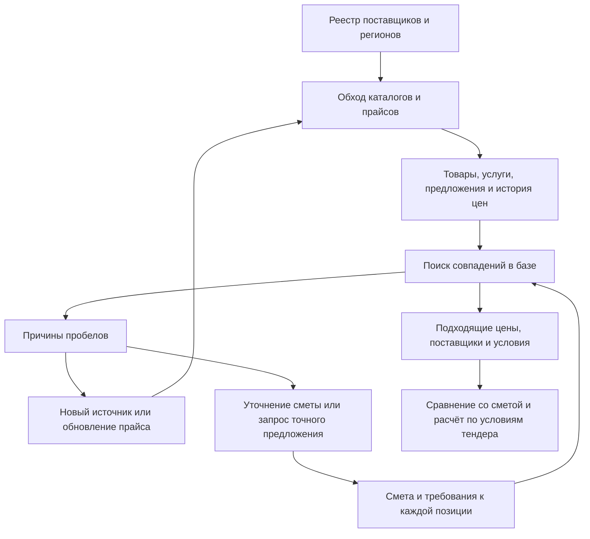

# Автобот: база поставщиков, товаров и цен

## Актуальный шаг: список потребностей до выбора сайтов

Уточнение пользователя: сначала составить, что именно требуется найти, затем выбирать и загружать подходящие каталоги. **Список составлен по свежему снимку «Волги»**, а не по ассортименту имеющейся базы: [полный перечень и первая партия](AUTOBOT_VOLGA_NEEDS.md), [Excel с фильтрами и исходными строками](outputs/autobot-volga-needs-20260921/Волга%20—%20список%20потребностей.xlsx).

152 потребности: **83 материала/изделия и 69 работ**. Непокрыты **64 материальные и 69 рабочих потребностей**, всего 133, соответствующие 187 строкам. 26 из 213 требующих цены строк уже покрыты. Все 259 исходных строк сохранены; 46 расчётных, корректирующих и отрицательных строк не превращены в новые товары. Противоречия IP, двух типов георешётки, недостающих диаметров и моделей отмечены рядом с конкретной потребностью. Источники и уточнения подбираются по этому перечню.

Первый пакет наполнения базы привязан к **N001–N013**: песок I класса мелкий, щебень М1200 20–40, растительная земля, четыре потребности в бетоне/смеси, шесть видов плитки/бордюров. Это **13 потребностей и 30 непокрытых строк**. Далее — дорожные материалы и металл, остальные материалы/оборудование и отдельные перечни подрядных работ. Новый источник допускается к массовой загрузке после проверки, какие конкретные ID и характеристики он может закрыть. Уже покрытые позиции сохраняются и обновляются, а не запускаются повторно ради количества.

Снимок production: 21.09.2026 09:32 UTC, AutoBot `3411247`, CRM до этого пакета `999dbd5`. Сверены все идентичности, исходные единицы/объёмы, 133 ID coverage-plan, 152 группировки, категории и формулы Excel; пересчёт с изменением/восстановлением исходной строки, сохранённые фильтры и три листа проверены. Код приложения, рабочие данные и исходная смета не менялись. Автотесты приложения и браузерные размеры не запускались: пакет содержит перечень и таблицу. Артефакты проверки — `tmp/autobot-needs-20260921/`. Работа со списком выполнена; подбор и импорт следующих поставщиков ещё не выполнялись.

## 21 сентября: сначала наполнение базы, затем новый массовый прогон

По уточнению пользователя приоритет возвращён к К1/К5/К6/К7: расширить и поддерживать базу предложений из открытых сайтов. База уже работает; отдельную конкурирующую БД создавать не нужно. Материалы и услуги храним заранее, а смета проверяет применимость сохранённых предложений. Поиск отдельных дорогих строк остаётся одним из способов выбрать следующий раздел, но не ограничивает состав загружаемого каталога.

### Что показала проверка рабочей базы

Read-only проверка production 21 сентября: **38 317 записей**, 608 сохранённых документов, 39 110 наблюдений. Из них 610 выведены из доступных предложений. У оставшихся **37 707** записей:

| Состояние записи источника | Количество |
|---|---:|
| Опубликована точная сумма, срок проверки ещё не истёк | 11 112 |
| Опубликована точная сумма, но срок проверки истёк | 22 286 |
| Условная цена, «от» или другие ограничения | 4 163 |
| Цена по запросу | 146 |

Это состояния прайса, а не подтверждение цены для тендера. Ещё проверяются характеристики, единица, количество, регион и состав. **37 289 записей (98,9% доступного каталога) относятся к одному домену svetelektro.net**. Остальные 16 доменов дают всего 418 записей. 27 настроенных разделов с данными не означают 27 независимых поставщиков. Поэтому рост общего числа записей до 38 тысяч почти не увеличил покрытие «Волги».

Исходные версии CRM `8e360f275795eee1cb2dc2350200c6ece69dac69`, AutoBot `3411247cef3a74a4a48eb6978fe1023895ec0925`. Снимки diff, локальный аудит и совпавший запрос к production сохранены в `tmp/autobot-catalog-first-20260921/`. Чужой checkpoint AutoBot сохранил SHA `1dd7e20d55c565b5277953c673f73a6fc357fdb2948b405e629553e77a02ebf8`. В этом обследовании новые цены в production не импортировались; код приложения и покрытие тендера не менялись.

### Порядок следующих пакетов

1. **Реестр потребностей и разделов.** Для каждой группы материалов записать нужные варианты, единицы и регион; связать с существующими предложениями и пробелами. Начать с Ярославской области, приоритет — песок/щебень/грунт, бетон/смеси, металл/трубы, дорожные материалы/ЖБИ, затем электротехника и оборудование. Песок затрагивает 9 строк «Волги», щебень — 4; металл, бетон и смеси также повторяются. Источники выбирать по ассортименту и условиям, а не размеру каталога.
2. **Небольшой законченный импорт одной группы.** Проверить 2–3 независимых поставщика; настроить чтение конкретного раздела целиком в объявленных границах, включая варианты и страницы. Сохранять каждый фактический товар, а не только совпавшие со сметой строки. Не заменять товарную цену минимальной ценой категории. Если поставщик даёт только «от» или цену по запросу, это отдельный результат проверки источника; продолжать поиск альтернативы.
3. **Обновление и качество базы.** Закончить К5: повторный импорт без дублей, изменение/исчезновение цены, продолжение после перезапуска, ограничение запросов. Отдельно показывать последнюю загрузку страницы и дату самого прайса: сегодняшняя загрузка не обновляет старую цену. Ошибка сайта не удаляет успешные наблюдения. Для каждого раздела нужны число доступных товаров, свежих точных сумм, условных цен, ошибок и непосещённых страниц.
4. **Файловые прайсы по потребности.** После первого полезного HTML-раздела подключать официальные XLSX, затем PDF тех поставщиков, у которых цены доступны только в файлах. Сохранять лист/строку либо страницу документа и условия таблицы. Каждый формат — отдельный проверяемый пакет; OCR без надёжной связи суммы и товара не подтверждает цену.
5. **Проверка на смете и повторное использование.** После каждой группы выполнить поиск из базы по всем соответствующим строкам «Волги», без общего веб-поиска. Показать новые подходящие предложения, конкретные оставшиеся несовпадения и время повторного запроса. Другая смета должна использовать те же факты о поставщике и товаре, но заново проверять свои условия. Успех группы измеряется пригодными предложениями и совпадениями, а не тысячами скачанных строк.
6. **Услуги и составные работы.** После расширения материалов отдельно подключать местных подрядчиков, технику и испытания. Полный расчёт 62 составных работ и совместная закупка одинаковых материалов остаются обязательными задачами; сама база товарных цен их не решает. Условия доставки, налогов, накладных и резерва задаются для тендера, неизвестные значения не заменяются нулём.

Условия одной записи: **товар/услуга и характеристики → поставщик → прямая ссылка → исходная цена и валюта → единица и упаковка → регион склада/доказанная доставка → минимальный объём и состав цены → дата прайса и дата проверки → сохранённый источник и история**. Исходную цену сохраняем вместе с пересчётом; цену за тонну нельзя превращать в цену за куб без подтверждённого основания. Сайты одного продавца не считаются независимыми источниками медианы.

### Ближайший проверяемый результат

Следующий пакет — **база региональных стройматериалов с полным импортом выбранных разделов и отчётом по качеству**. До правок зафиксировать конкретные источники/границы и проверочные товары, после импорта сравнить результат с нынешними 418 записями за пределами СветЭлектро. Для принятого раздела обязательны ссылки на реальные товары, верные единицы/варианты/условия, подтверждение региона, история и безопасный повтор. Подходящие цены должны воспроизводиться чтением БД без повторного обхода сайтов. Не объявлять группу завершённой только потому, что набралось 2–3 сайта.

Предварительно проверены открытые сайты [Ярославского речного порта](https://yarport.com/tovary/pesok-karernyy.php), [Инвестнеруда](https://investnerud.ru/), [Инвестпоставки](https://www.investpostavka.ru/). Это кандидаты в реестр, не уже подключённые источники: у порта карьерный песок по договорной цене; у Инвестнеруда цена в тоннах с индивидуальными условиями; в разделе круга Инвестпоставки цены «от». Их нельзя заранее засчитать как новые подтверждения. Источник Металлоторг вернул 403 — ограничение не обходили.

Бесплатные открытые сайты остаются единственным разрешённым источником. Цель 192/213 для «Волги» сохраняется, но база не гарантирует публичную цену заказных изделий и полный состав работ. Последний проверенный результат — 26/213 (12,2%). В этом уточнении плана выполнены аудит БД и исследование источников; реализация перечисленных пакетов, новый импорт и новый контрольный прогон остаются впереди. Тесты приложения и визуальные проверки не запускались, поскольку код и интерфейс не менялись.

## История: первый пакет 20 сентября

Дата: 20 сентября 2026 года. Статус: **первый рабочий пакет опубликован и проверен; шесть production-импортов завершены**. В базе есть название товара/услуги, цена, ссылка, поставщик и регион.

Текущий результат: схема каталога, загрузка шести выбранных разделов, 295 записей (106 точных сумм источника / 47 условных цен / 142 по запросу), история, очередь с продолжением и сопоставление с обычным поиском тендера. Экран «Поставщики и цены» доступен в навигации. Production: 132 страницы, 0 ошибок; чтение каталога для 127 строк «Волги» дало 6 совпадений за 2,247 с, без роста покрытия. Отчёт и оставшиеся этапы — [пилот от 20 сентября](AUTOBOT_SUPPLIER_CATALOG_PILOT_2026-09-20.md). Полный план К0–К12 не объявляется выполненным: карта 127 требований подготовлена, контрольная разметка ещё не завершена; автоматическое обновление, файловые прайсы, расширение по пробелам и полная приёмка впереди.

## Решение

Создать пополняемую базу реальных поставщиков и их предложений. Автобот загружает выбранные каталоги заранее, сохраняет характеристики товаров, цены и условия, затем сопоставляет строки сметы с этой базой. Интернет используется для обновления источников и поиска того, чего в базе ещё нет.

Единица подключения — один поставщик и конкретный раздел его каталога. Сначала доводим этот путь до результата в тендере, затем подключаем следующие разделы и сайты. Так база начинает приносить пользу до завершения большого сбора. Полнота измеряется внутри объявленного раздела: ограниченный или прерванный обход не называется полным каталогом.

## На что опираемся

Проверены текущий код и сохранённый результат «Волги» от 20 сентября, 08:03 UTC. Повторного живого поиска в рамках подготовки плана не было.

| Что уже существует | Как используем |
|---|---|
| `supplier_catalogs.json`: 13 записей источников | Начальный список для проверки и переноса в управляемый реестр. Запись в списке пока не означает проверку юридического лица |
| `supplier_catalogs.py` | Сейчас выбирает до трёх подходящих каталогов и отдельные ссылки. Расширяем получение ссылок до явного обхода выбранного раздела |
| `market_source_adapters.py`, HTTP и браузерный загрузчик | Сохраняем извлечение со страниц, добавляем необходимые адаптеры каталогов и файлов |
| `market_price_index.py`, SQLite `data/market_index/market_prices.sqlite3` | Уже хранит наблюдения, полученные при поиске по строкам, и повторно использует подходящие цены. Дополняем каталогом, не заводим конкурирующую базу проверенных цен |
| Требования позиции и единая проверка доказательств | Сохраняем проверки характеристик, единиц, региона, срока и условий цены при каждом сопоставлении |
| Очередь поиска и публикация результатов | Сохраняем API, остановку, повтор и привязку результата к версии сметы. Обход каталога получает отдельные задания, не фиктивные строки тендера |

Репозиторий Автобота: `C:/Users/UserVik/Desktop/code/auto_bot`. Исходные версии: AutoBot `c706f2089240d37deeec658879078909a4ae74d8`, CRM `46679cb11a74681b1be84b76ecb02e89f9f9c351`. CRM tracked diff до планирования пустой; `.agents/`, `.codex/` и изменение `data/search_resume_checkpoint.json` сохраняются. Исходные diff и контрольная сумма checkpoint записаны в `tmp/autobot-supplier-catalog-plan-20260920/`.

### Исходная точка «Волги»

Тендер `0171200001926000664`, Ярославская область. Используем состояния `price_coverage` и `price_state`, а не исторический счётчик «обработано».

| Тип | Всего | Подходящая цена | Предложение с ограничениями | Требуется уточнение | Цена не найдена | Исключено из самостоятельного поиска |
|---|---:|---:|---:|---:|---:|---:|
| Материалы | 41 | 6 | 12 | 18 | 5 | 0 |
| Работы | 77 | 0 | 32 | 7 | 38 | 0 |
| Прочее | 9 | 0 | 0 | 6 | 0 | 3 |
| **Итого** | **127** | **6** | **44** | **31** | **43** | **3** |

Покрытие составляет 4,49% стоимости распознанных строк. Это не доля полной цены контракта и не рассчитанная прибыль. Последняя проверка повторяла четыре выбранные позиции; остальные состояния сохранились от предыдущих запусков. Подробности — в [отчёте от 20 сентября](AUTOBOT_MULTICATEGORY_2026-09-20.md).

Материалы составляют только 41 строку. Для результата по всей смете нужны также прайсы подрядчиков, восстановление неполных требований и точные предложения на заказные работы/крупные партии. Например, опубликованная цена песка для небольшой партии не определяет цену поставки примерно 932 м³.

## Что храним в базе

Это структурированные записи с доказательствами. Текстовый поиск помогает их найти; пригодность цены определяется относительно конкретной потребности.

| Сущность | Обязательные сведения |
|---|---|
| Поставщик | Постоянный ID, название, сайты, публичные контакты/реквизиты и ссылки на них, категории, регион присутствия, заявленная география поставки, дата и уровень проверки |
| Источник/раздел | Реальный URL, связь с поставщиком, область обхода, формат, способ загрузки, ограничения запросов, последняя удачная проверка и причина ошибки |
| Товар или услуга поставщика | Его артикул/ID и URL, исходное название, тип, категория, извлечённые характеристики, единицы, упаковка; для услуги — состав операции |
| Предложение | Связь с товаром, исходная сумма и единица, валюта, фасовка, партия/ступени цены, наличие, НДС как указано в источнике, доставка, область действия, «от»/«по запросу»/другие условия |
| Наблюдение и доказательство | Дата получения, указанная источником дата прайса, URL, снимок/фрагмент или строка файла, хеш, версия извлечения, срок пригодности и история изменений |
| Сопоставление со сметой | Версия сметы и требований, предложение, совпавшие/неизвестные/противоречащие признаки, пересчёт единицы, применимость к объёму и региону, причина решения |
| Задание обхода | Источник, границы обхода, очередь URL, курсор, попытки, прогресс, ограничения времени, остановка и результат |

Начинаем с SQLite и существующего индекса. Новые таблицы каталога добавляются рядом с ним; старые API чтения проверенных предложений сохраняются. Конкретную схему и миграцию фиксируем в К2. Товар одного поставщика можно сохранить до установления эквивалентности товару другого; похожие названия автоматически не склеиваются.

Денежные суммы нового контура хранятся в копейках; исходная десятичная цена и коэффициенты единиц сохраняются для точного пересчёта. В текущем индексе есть поля `REAL`: К2 отдельно определяет совместимость с ними, без массового округления или переписывания исторических данных.

## Правила, которые должны сохраниться

- Проверенный сайт не делает каждую его цену пригодной. Проверка поставщика, извлечение предложения и соответствие строке сметы — разные результаты.
- Регион берём из доказательств присутствия/поставки. Возможность доставки в регион не означает известную стоимость доставки до объекта. Для местной услуги нельзя использовать географию доставки товаров.
- Цена относится к точному варианту и собственной строке прайса. Метры, тысячи метров, м², рулоны, тонны, м³, часы и смены пересчитываются только по известному основанию. Противоречие в характеристиках не компенсируется похожим названием.
- Цена «от», устаревший прайс, неподходящая партия или неизвестная комплектация сохраняются с причиной ограничения. Ноль не подставляется вместо отсутствующей цены. Условия количества применяются заново для каждого тендера.
- Неизвестный НДС, доставка и состав услуги остаются неизвестными. Нельзя усреднять предложения с различной или неустановленной базой сравнения; готовность экономики показывается отдельно от наличия опубликованной цены.
- Один поставщик на нескольких сайтах не становится несколькими независимыми источниками. Неустановленную связь отмечаем отдельно. При одной пригодной цене показываем «цена одного поставщика»; при нескольких сопоставимых независимых предложениях — минимум, медиану и число поставщиков.
- Срок цены не обновляется от чтения базы или старого кеша. Новый успешный запрос и дата самого прайса учитываются отдельно. Новая цена/отзыв предложения пересматривают пригодность прежнего наблюдения; сбой обхода сам по себе не означает исчезновение товара.
- Все 127 строк получают объяснимый результат, включая поправки и неполные позиции. «Обработана строка» и «найдена подходящая цена» считаются отдельно.
- Для расценки устанавливаем состав: работа, материалы и техника могут уже входить в её цену. Поправку связываем с основной расценкой; ресурс внутри комплексной работы не прибавляем повторно. Исключение строки из самостоятельного поиска не означает исключение её влияния из расчёта.
- Источник сметы, текущие URL/API, права, остановка очереди, повторная публикация, Excel и сохранённые пользовательские условия остаются рабочими. Доставка, налоги, накладные и резерв задаются для конкретного тендера.

## Пакеты реализации

Пакеты выполняются последовательно по зависимостям. Один пакет завершается демонстрацией результата, проверками и записью состояния. Если пакет содержит несколько сайтов/форматов, каждый подключается отдельным изменением с собственной приёмкой. В таблице — предлагаемый порядок, все пакеты пока открыты.

| Пакет | Законченный результат | Проверка готовности | Зависимость |
|---|---|---|---|
| **К0. Карта потребности** | На копии «Волги» каждая строка связана с исходным документом, категорией и конкретной причиной пробела. Выбрана контрольная выборка | Учтены все 127 строк; сохранены версии/хеши и исходные состояния; материалы, работы и поправки разделены. Есть контрольные примеры правильного совпадения и обязательного отказа | Нет |
| **К1. Реестр поставщиков** | Проверены 13 начальных записей; для пробелов подобраны дополнительные реальные сайты. У каждого есть карточка доказательств и выбранный раздел | Поставщик отличим от агрегатора/дубля; контакты и регион имеют источники; видны цены/только запрос/недоступность. Назначен один источник первого импорта | К0 |
| **К2. Хранилище каталога** | На изолированной БД сохраняются поставщик, товар, предложение, доказательство и история; старый индекс продолжает читаться | Повторный импорт не создаёт дублей, изменение цены сохраняет историю, запись атомарна, повтор после перезапуска безопасен. Проверены миграция и откат на копии | К1 |
| **К3. Один каталог целиком в объявленных границах** | Загружен выбранный раздел одного поставщика со всеми обнаруженными страницами и вариантами, а не только результат запроса по одной строке | Реальная пагинация/ссылки, артикулы, цены и единицы проверены на сохранённых страницах. Отчёт: обнаружено/прочитано/разобрано/не удалось; предел обхода явно виден | К2 |
| **К4. Цена из базы в тендере** | Существующий поиск сначала сопоставляет требования с каталогом и публикует пригодные предложения через текущий механизм | На контрольных строках видны товар, цена, источник, дата и причина выбора. Повтор по свежей базе проходит без поисковых запросов; другая партия/регион перепроверяются. Тесты чужого варианта и упаковки дают отказ | К3 |
| **К5. Обновление и восстановление** | Фоновый обход источника можно ограничить, остановить и продолжить; изменившиеся и просроченные предложения пересматриваются | Перезапуск с курсора, повтор без дублей, истечение срока, изменение/удаление цены, 429/таймаут/недоступный сайт. Ошибка одной страницы не теряет успешные результаты и не удаляет весь каталог | К4 |
| **К6. Следующие каталоги материалов** | Источники подключаются партиями по одному сайту и одной категории; растёт число пригодных предложений в базе | Для каждого источника: примеры извлечения, независимость продавца, регион, характеристики, повторный импорт и реальные новые совпадения. Статистика сырых товаров отделена от пригодных цен | К5 |
| **К7. Прайсы в файлах** | Официальные XLSX, затем PDF поставщиков попадают в тот же каталог; каждый формат принимается отдельно | Сохраняются документ/версия/лист/строка либо страница и фрагмент; цена связана с товаром и заголовками единиц/условий. Ошибки распознавания не превращаются в подтверждённые суммы | К5; приоритет по источникам К1/К6 |
| **К8. Восстановление требований** | Неполные строки исправляются небольшими группами по исходным документам с сохранением предыдущей версии | Для каждого восстановленного признака есть исходное место. Если сведений нет — конкретное уточнение. Старое сопоставление не переносится на изменённые требования без проверки; итог виден после повторного открытия | К0, К4; можно начать до завершения К6–К7 |
| **К9. Работы и техника** | Отдельно подключены прайсы подрядчиков, затем аренда/перевозка; каждая группа проходит свой небольшой пакет | Операция, состав, способ, единица времени/объёма, регион, минимальный заказ и включённые затраты проверены. Цена товара не становится ценой работы, монтаж в гофре не становится протяжкой в готовой трубе | К4–К5; К7 для файловых прайсов |
| **К10. Пополнение по пробелам** | Строки без результата порождают понятное действие: обновить источник, найти новый, уточнить характеристику или подготовить запрос предложения | Одинаковые потребности объединяются в одно исследование; есть лимит запросов, пауза после отказа и причина завершения. Новый источник пополняет базу и запускает повторное сопоставление затронутых строк | К6–К9 |
| **К11. Управление в Автоботе** | Раздел «Поставщики и цены» показывает источники, товары и обновления; из строки сметы можно понять происхождение цены и следующий шаг | Фильтры региона/категории/ошибки/срока, одна основная кнопка на блок, запуск/остановка/повтор. Проверены роли на сервере, сохранение и повторное открытие, 390/768/1280 px | К4–К5; результаты остальных пакетов подключаются по мере готовности |
| **К12. Полный контрольный прогон** | «Волга» проходит через базу, обновления и обработку пробелов; отчёт сравнивает результат с исходной точкой | Все строки учтены; принятое подтверждено источниками; измерены покрытие, ошибки и время первого/повторного запуска. Проверены ещё одна смета и повторное использование без лишнего обхода сайтов | К6–К11 |

### Первый результат и границы пилота

**Первая демонстрация — после К4:** выбранный раздел сайта → сохранённый каталог → точное совпадение → цена и ссылка в существующей карточке тендера → повтор из базы. Для неё не нужно ждать подключения всех поставщиков или нового большого интерфейса.

Первый кандидат для импорта — раздел АВБШв ЭКЦ: на нём уже воспроизведён подходящий вариант кабеля «Волги». Доступность и границы раздела заново проверяются в К1. Бетон и Geo76 нужны для контроля повторного использования и сложных единиц. Отдельный контрольный геотекстиль с известной плотностью не выдаётся за исправленную строку «Волги».

Регион пилота — Ярославская область плюс поставщики с доказанной доставкой туда. Плановый объём первого расширения — **10–15 самостоятельных поставщиков суммарно**, включая пригодные из первоначального списка; фактический состав зависит от проверки, а не от достижения числа записей. В К6 категории добавляются по пробелам и стоимости: металл, ЖБИ/бордюры, сыпучие материалы, сухие смеси, затем следующие группы из К0. Дорогие неизвестные строки получают приоритет, исходные суммы при этом не объявляются полной экономикой контракта.

В К9 первыми проверяются дорожные работы и электромонтаж из «Волги». Публичные ориентиры сохраняются вместе с ограничениями; для проектных работ или крупных партий формируется список данных для точного предложения. Отправка сообщений поставщикам в этот план не входит. Полученное пользователем КП можно импортировать с областью действия и сроком; частное КП одного тендера нельзя автоматически раскрывать или применять в другом.

## Как загружаем и ищем

1. Обнаруживаем разделы и карточки по реальным ссылкам, sitemap и опубликованным прайсам выбранного источника. Динамические страницы загружаем существующим браузерным механизмом; обычные страницы — HTTP. Для источника заранее известны границы обхода и допустимые переходы.
2. Ограничиваем запросы к одному сайту, размер документов и время обработки. Сохраняем очередь страниц; таймаут должен ограничивать также зависший разбор документа. Учитываем правила доступа сайта, при блокировке сохраняем причину и останавливаем повторение.
3. Сначала сохраняем наблюдение, затем извлекаем товар и предложение. Частично разобранный каталог остаётся частичным; исчезновение товара фиксируется только после достаточной успешной проверки, а не после ошибки загрузки.
4. Ищем в базе по категории, артикулу/модели и характеристикам; затем применяем условия единиц, количества, региона, актуальности и сравнимости цен. Ранжирование похожих названий не заменяет эти проверки.
5. Для пробела запускаем ограниченное исследование поставщиков, а найденное предложение сохраняем для следующих смет. Повторяющиеся запросы объединяем с сохранением отдельных требований каждой позиции.

Период обновления выбираем по категории, условиям самого прайса и спросу на товар. Каталог и часто используемые цены могут обновляться с разной частотой. Перед финальным расчётом тендера просроченные предложения требуют нового получения. К5 фиксирует конкретные интервалы, ограничения нагрузки и стоимость хранения после замера первого каталога.

ИИ, включая возможное подключение Gemini, можно позже использовать для словаря сметных названий и предложения кандидатов. Он не подставляет недостающую цену, регион, размер или срок и не снимает обязательные проверки. Наличие платного поиска, отдельной модели, Hermes или Авито не требуется для К0–К12. Векторный поиск имеет смысл рассматривать только после измеренного ограничения обычного поиска по структурированному каталогу.

## Приёмка качества

В К0 фиксируем **20 различных контрольных потребностей** с доступными исходными характеристиками, охватывающих материалы и работы, и **не менее 10 случаев обязательного отказа**: чужая марка, упаковка, соседняя строка, «от», партия, устаревшая цена, другой регион, неполное требование. Для каждой потребности заранее записываем ожидаемые подходящие источники либо обоснованное отсутствие публичной сопоставимой цены. Искусственные примеры нужны для проверки ошибок, но не засчитываются как покрытие реального тендера.

| Метрика | Что именно измеряем |
|---|---|
| Точность принятия | На контрольных примерах нет ошибочно принятой цены; перед приёмкой К12 вручную сверены все принятые предложения «Волги». Пропущенные подходящие предложения учитываются отдельно |
| Полнота импорта | Обнаруженные URL/строки в объявленной области, успешно прочитанные и разобранные, пропуски с причинами; каталог с неизвестным концом обхода не считается полным |
| Покрытие | Пригодные цены по всем 127 строкам и отдельно по материалам/работам/прочим; дополнительно — по строкам с полными требованиями и стоимости распознанных строк. Знаменатель не меняется скрыто |
| Независимость | Доля позиций с одним, двумя и тремя самостоятельными поставщиками; копии одного продавца не повышают показатель |
| Актуальность | Доля действующих/просроченных предложений; дата реального получения и дата прайса; изменение цены и недоступность сайта различимы |
| Скорость | Время импорта, первого сопоставления и повтора; обращения к сети и доля ответов из базы. На свежем контрольном каталоге повтор не требует сетевого поиска |
| Пробелы | Отдельно отсутствие характеристик, источника, опубликованной цены, совместимости, региона, действующего прайса и ошибка получения |
| Восстановление | Повтор задания, остановка, перезапуск, новая версия сметы, падение отдельного сайта и безопасное повторное применение результата |

Обязательное условие К12: сохранить пригодные исходные результаты, если источники остаются действующими, получить новые доказанные совпадения и показать, какие позиции всё ещё не закрыты и почему. Количественную цель покрытия по категориям фиксируем после К0–К1 по фактически доступным предложениям, до расширения и контрольного запуска; меняем её только с записанным основанием. Среди заранее размеченных доступных подходящих предложений не должно оставаться необъяснённых пропусков. Проверка включает позиции вне примеров, по которым настраивались парсеры. Наличие результата у каждой строки обязательно. Обещание публичной точной цены на каждую работу или заказной товар в критерии не закладываем.

## Порядок безопасного внедрения

До реализации каждого пакета фиксируем текущий diff, наблюдаемый результат и затронутые сценарии. Первые импорты, тестовые записи и миграционные эксперименты выполняются на изолированной копии. К2 должен дать конкретный план схемы, версию миграции, резервирование БД и доказательств, успешное восстановление, проверку старого чтения, повтор миграции и способ отката. Этот документ не запускает миграцию рабочих данных.

Каталог включается поэтапно: импорт → проверка на копии → сопоставление без изменения опубликованных результатов → включение для выбранного тендера → расширение. Исторические предложения и исходные Excel сохраняются. Для общего каталога и пользовательских/закрытых прайсов задаются разные права; загрузчик проверяет адреса источников и перенаправления на сервере.

Для пакетов логики — затронутые Python-наборы из изолированной копии, затем необходимые проверки очереди, индекса, требований и публикации. Для UI — существующие frontend-наборы и браузерная матрица. Перед выпуском общей схемы/очереди и завершением пилота — расширенный прогон; результаты фиксируются с именами падений и областью проверки. Перед production — сверка версии сервера, резерв с проверкой восстановления, откат и проверка опубликованного поведения по правилам проекта.

## Состояние после контрольного прогона 20 сентября

Первый пилот хранения/обхода/сопоставления опубликован; продолжение восстановило полную смету Волги, расширило каталог до 37 599 доступных записей и проверило все 213 требующих поиска строк. Пригодная цена есть для 11, предложения с уточнениями — для 156, цены нет — для 46. Прежний знаменатель 127 заменён явно после восстановления пяти PDF: 259 строк, из них 46 расчётных. Это частичная реализация и проверка программы К0–К12, не приёмка массового покрытия всех категорий.

Подробности пилота — в [первом отчёте](AUTOBOT_SUPPLIER_CATALOG_PILOT_2026-09-20.md), итоговый перенос, реальные метрики и исправления — в [отчёте полного прогона](AUTOBOT_VOLGA_COVERAGE_2026-09-20.md).

Следующий пакет: выделить технические пробелы (27 попыток с лимитом, 16 с недоступными источниками), прямые каталоги конкретных моделей и цветовых вариантов, местные прайсы состава работ и отдельный список партий/изделий для КП. Проверять полноту по всем непокрытым категориям, точность принятия, актуальность, упаковки и регион; количество записей в базе не является критерием успеха. Сообщения поставщикам и платный поиск не включены. Требования исходного плана и экономики сохраняются.

Дополнение после следующего пакета: AutoBot `e71d70b` опубликован. Шесть новых поставщиков и дополнительные карточки ТИНКО, корректная цена упаковки, кг/т и точное сопоставление артикулов увеличили покрытие до **20/213** (18 материалов/товаров, 2 работы). Каталог содержит 37 634 доступные записи. Все 259 строк проверены по базе, 40 выбранных технических пробелов повторены через веб; последний повтор новых подтверждений не дал. 161 строка остаётся с уточнениями, 32 без предложения. Старые 11 цен и экономика сохранены; завершение К0–К12 этим не объявляется. Следующий шаг — короткие коммерческие запросы без модели, сбойный бесплатный провайдер, прямые региональные прайсы оставшихся категорий. [Подробный результат и применённый план переноса](AUTOBOT_VOLGA_MORE_PRICES_2026-09-20.md).
